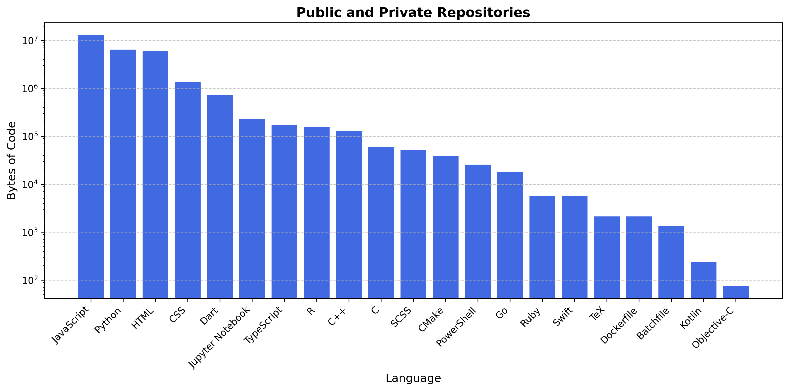

## 👋

From modelling 🐟 to trying to centre a div.

Dayjob: Providing programming assistance and building apps/services for marine researchers.

- Language breakdown (public and private repos)

Yeah all that typescript...that was forked.
  
